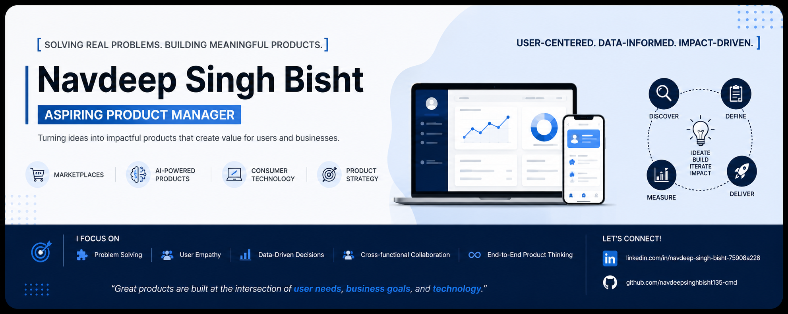

  

# 👋 Hi, I'm Navdeep Singh Bisht

Aspiring Product Manager | AI Products | Marketplaces | GTM Strategy

📍 Haldwani, Uttarakhand, India

🔗 Portfolio: [https://app.notion.com/p/Portfolio-09a01f8b3a4c41b9b810d132124255b6?source=copy_link]

🔗 LinkedIn: [www.linkedin.com/in/navdeep-singh-bisht-75908a228]

🔗 Resume: []

---

## 🚀 Featured Projects

### 1. ParkKumaon
- Smart Parking Marketplace
- User Problem Analysis
- Business Model
- Product Strategy****

### 2. Local Assured Commerce
- Hyperlocal Commerce Platform
- PRD
- Wireframes
- Launch Strategy

### 3. Jio OnePass
- Loyalty Ecosystem Concept
- Product Vision
- User Journey
  
### 4. Myntra M-Live
- Product Requirements Document (PRD)
- GTM Strategy
- User Research
- Launch Planning

---

## 🛠 Skills

- Product Strategy
- User Research
- PRD Writing
- GTM Strategy
- Product Analytics
- Wireframing
- Stakeholder Management

---

## 🔧 Tools

- Figma
- Miro
- Notion
- Jira
- SQL
- Google Analytics
- Excel

---

## 📈 Currently Learning

- Product Metrics
- SQL for PMs
- AI Product Management
- A/B Testing

---

## 📬 Let's Connect

LinkedIn:[www.linkedin.com/in/navdeep-singh-bisht-75908a228]
Portfolio:[https://app.notion.com/p/Portfolio-09a01f8b3a4c41b9b810d132124255b6?source=copy_link]
GitHub:[https://github.com/navdeepsinghbisht135-cmd/Navdeep.git]
